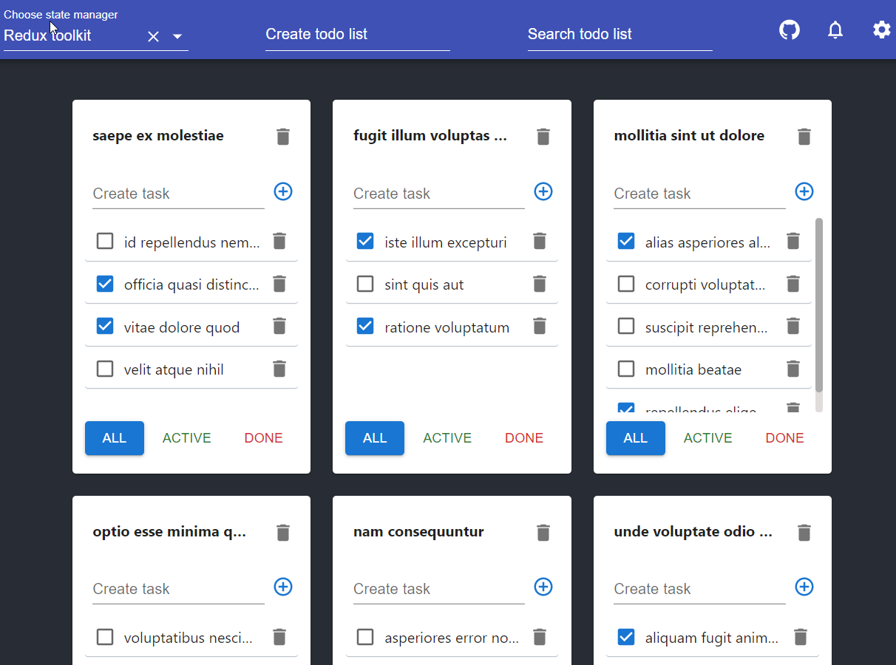

# State managers



## Deploy

- https://state-managers-comparison.netlify.app/

## Prerequisites

- Git - [Download & Install Git](https://git-scm.com/downloads).
- Node.js - [Download & Install Node.js](https://nodejs.org/en/download/) and the npm package manager.

## Downloading

```
git clone {repository URL}
```

## Installing

```
1. yarn install
2. yarn start
3. configure SSL certificate as described below
```

## Configure SSL
To run the application locally, you should configure ssl, since the service worker will not work without it.
You need to create a `.cert` folder in the root directory of the repo and put `cert.pem` and `key.pem` in it.
See links below for ssl configuration.

### SSL configuration links
- https://github.com/FiloSottile/mkcert
- https://chocolatey.org/install
- https://www.freecodecamp.org/news/how-to-set-up-https-locally-with-create-react-app/
```
For firefox: mkcert -CAROOT. Check location of rootCA.crt and import it manually to firefox certificates
``` 
